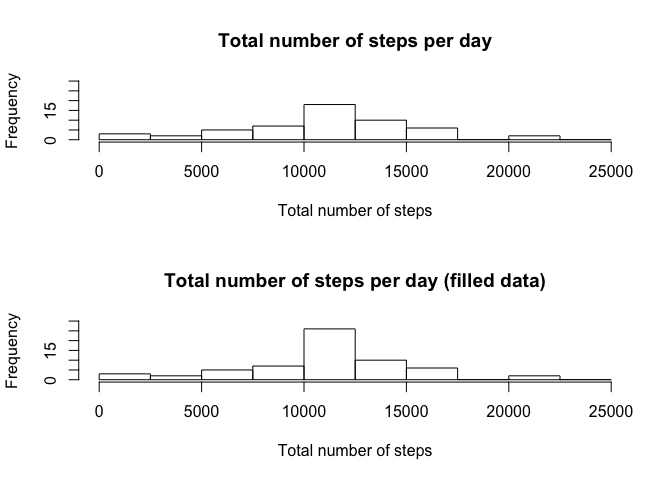

# Reproducible Research: Peer Assessment 1


## Loading and preprocessing the data

Unziping and loading the data

```r
unzip("activity.zip")
original_data<-read.csv("activity.csv",header = T,as.is = T)
```

Let's check the content of the data just loaded

```r
head(original_data)
```

```
##   steps       date interval
## 1    NA 2012-10-01        0
## 2    NA 2012-10-01        5
## 3    NA 2012-10-01       10
## 4    NA 2012-10-01       15
## 5    NA 2012-10-01       20
## 6    NA 2012-10-01       25
```

```r
str(original_data)
```

```
## 'data.frame':	17568 obs. of  3 variables:
##  $ steps   : int  NA NA NA NA NA NA NA NA NA NA ...
##  $ date    : chr  "2012-10-01" "2012-10-01" "2012-10-01" "2012-10-01" ...
##  $ interval: int  0 5 10 15 20 25 30 35 40 45 ...
```

It could be useful to convert the date variable into date format, and the interval data into intervals of 5 minutes instead of the format HHMM, more difficult to work with when dealing with durations:

```r
original_data$date<-as.Date(original_data$date,format="%Y-%m-%d")
#To get the minute of the day starting the interval, we need to take the hundred part
#of the original number (the hour), and multiply by 12 (12 intervals per hour) and by 5 
#(5 minutes per interval), and sum the remaining minutes (two last numbers of original 
#data)
original_data$interval<-floor(original_data$interval/100)*12*5+(original_data$interval%%100)
str(original_data)
```

```
## 'data.frame':	17568 obs. of  3 variables:
##  $ steps   : int  NA NA NA NA NA NA NA NA NA NA ...
##  $ date    : Date, format: "2012-10-01" "2012-10-01" ...
##  $ interval: num  0 5 10 15 20 25 30 35 40 45 ...
```


## What is mean total number of steps taken per day?

Let's first calculate the number of steps per day

```r
total_steps_day<-aggregate(steps ~ date, original_data, sum)
hist(x = total_steps_day$steps,
     breaks=c(0, seq(2500,25000, 2500)),
      main = "Total number of steps per day", 
      xlab = "Total number of steps", 
      ylab = "Frequency")
```

<!-- -->

The summary of statistics includes the mean and median. Applying it to the total steps per day, we get:

```r
summary(total_steps_day$steps)
```

```
##    Min. 1st Qu.  Median    Mean 3rd Qu.    Max. 
##      41    8841   10760   10770   13290   21190
```

## What is the average daily activity pattern?

Let's calculate the average number of steps in each interval of the day:

```r
avg_steps_interval<-aggregate(steps ~ interval, original_data, mean)

#Prepare labels of x-axis (times in format HH:MM, instead of cumulative 5 minute intervals)
interval_hour = formatC(floor(avg_steps_interval$interval/(12*5)),width=2,flag="0")
interval_minute = formatC(avg_steps_interval$interval%%(12*5),width=2,flag="0")
interval_char=paste(interval_hour,interval_minute,sep = ":")

plot(x = avg_steps_interval$interval, y = avg_steps_interval$steps,  
     pch = ".", 
     main = "Average daily activity pattern", 
     xlab = "Time (5-minute intervals)", 
     ylab = "Average number of steps",
     xaxt="n")
lines(x = avg_steps_interval$interval, y = avg_steps_interval$steps)
#Setting x-axis with hour info
axis(1, 
     at=seq(from=0,to=1435,by=120), 
     labels=interval_char[seq(from=1,to=288,by=24)])
grid(col = "gray")
```

<!-- -->

And the interval with maximum number of steps, in average across all days, is:

```r
interval_max_steps<-avg_steps_interval$interval[avg_steps_interval$steps==max(avg_steps_interval$steps)]
interval_max_steps
```

```
## [1] 515
```

corresponding to the following hour of the day (each hour has 12 intervals of 5 minutes):

```r
interval_hour<-floor(interval_max_steps/(12*5))
interval_minute<-interval_max_steps%%(12*5)
```

which is 8:35.

## Imputing missing values

The number of missing values (NAs) is:

```r
number_missing_values<-sum(is.na(original_data$steps))
number_missing_values
```

```
## [1] 2304
```

which corresponds to a 13.1147541% of the total data.

In order to fill in these missing values, we are going to use the mean value for that interval across all days.

```r
#Create new variable that will hold the filled data
filled_data<-original_data
#Determine the missing values
missing_values<-is.na(original_data$steps)
#Fill in the missing values with the mean value for that interval
filled_data$steps[missing_values]<-avg_steps_interval$steps[(filled_data$interval[missing_values]/5+1)]
#The division among 5 and sum 1 is in order to get the row corresponding to the interval.
#If we are referring of the minutes 15-20 of a day, it corresponds to the 
#4th interval, this is 15/5 + 1.
```

Let's calculate now the total number of steps per day over the filled data set:

```r
#Calculate total number of steps each day
total_steps_day_filled_data<-aggregate(steps ~ date, filled_data, sum)
hist(x = total_steps_day_filled_data$steps,
     breaks=c(0, seq(2500,25000, 2500)),
      main = "Total number of steps per day (filled data)", 
      xlab = "Total number of steps", 
      ylab = "Frequency")
```

<!-- -->

And the corresponding summary statistics:

```r
summary(total_steps_day_filled_data$steps)
```

```
##    Min. 1st Qu.  Median    Mean 3rd Qu.    Max. 
##      41    9819   10770   10770   12810   21190
```

Let's compare the values before and after filling the data,

```r
par(mfrow=c(2,1))
hist(x = total_steps_day$steps,
     breaks=c(0, seq(2500,25000, 2500)),
      main = "Total number of steps per day", 
      xlab = "Total number of steps", 
      ylab = "Frequency")
hist(x = total_steps_day_filled_data$steps,
     breaks=c(0, seq(2500,25000, 2500)),
      main = "Total number of steps per day (filled data)", 
      xlab = "Total number of steps", 
      ylab = "Frequency")
```

<!-- -->

as well as the summary statistics:

```r
summary(total_steps_day$steps)
```

```
##    Min. 1st Qu.  Median    Mean 3rd Qu.    Max. 
##      41    8841   10760   10770   13290   21190
```

```r
summary(total_steps_day_filled_data$steps)
```

```
##    Min. 1st Qu.  Median    Mean 3rd Qu.    Max. 
##      41    9819   10770   10770   12810   21190
```

It seems like the missing values does not affect much the general trends.

## Are there differences in activity patterns between weekdays and weekends?

Let's classify each day in weeday or weekend, adding this information to a new variable, dayType:

```r
#Factoring depending if day is Saturday OR Sunday (weekend), or not (weekday)
filled_data$dayType<-factor(weekdays(filled_data$date)=="Saturday"|weekdays(filled_data$date)=="Sunday",levels=c(FALSE,TRUE),labels = c("WEEKDAY","WEEKEND"))
```


```r
#Calculate average total steps by interval and dayType (weekday vs. weekend) across 
#all days
avg_steps_interval_dayType<-aggregate(steps ~ interval+dayType, filled_data, mean)

#Prepare labels of x-axis (times in format HH:MM, instead of cumulative 5 minute intervals)
interval_hour = formatC(floor(avg_steps_interval_dayType$interval/(12*5)),width=2,flag="0")
interval_minute = formatC(avg_steps_interval_dayType$interval%%(12*5),width=2,flag="0")
interval_char=paste(interval_hour,interval_minute,sep = ":")

par(mfrow=c(2,1))
#In both plots, y-limit is 250 to better compare them, and x-axis labels are supressed

#Plotting week days
plot(x = avg_steps_interval_dayType$interval[avg_steps_interval_dayType$dayType=="WEEKDAY"], 
     y = avg_steps_interval_dayType$steps[avg_steps_interval_dayType$dayType=="WEEKDAY"],  
     pch = ".", 
     main = "Average daily activity pattern for weekdays", 
     xlab = "Time (5-minute intervals)", 
     ylab = "Average number of steps",
     ylim = c(0,250),
     xaxt="n")
lines(x = avg_steps_interval_dayType$interval[avg_steps_interval_dayType$dayType=="WEEKDAY"], 
      y = avg_steps_interval_dayType$steps[avg_steps_interval_dayType$dayType=="WEEKDAY"])

#Setting x-axis labels with hour info
axis(1, 
     at=seq(from=0,to=1435,by=120), 
     labels=interval_char[seq(from=1,to=288,by=24)])
grid(col = "gray")

#Plotting weekend days
plot(x = avg_steps_interval_dayType$interval[avg_steps_interval_dayType$dayType=="WEEKEND"], 
     y = avg_steps_interval_dayType$steps[avg_steps_interval_dayType$dayType=="WEEKEND"],  
     pch = ".", 
     main = "Average daily activity pattern for weekends", 
     xlab = "Time (5-minute intervals)", 
     ylab = "Average number of steps",
     ylim = c(0, 250),
     xaxt="n")
lines(x = avg_steps_interval_dayType$interval[avg_steps_interval_dayType$dayType=="WEEKEND"], 
      y = avg_steps_interval_dayType$steps[avg_steps_interval_dayType$dayType=="WEEKEND"])

#Setting x-axis with hour info
axis(1, 
     at=seq(from=0,to=1435,by=120), 
     labels=interval_char[seq(from=1,to=288,by=24)])
grid(col = "gray")
```

<!-- -->
